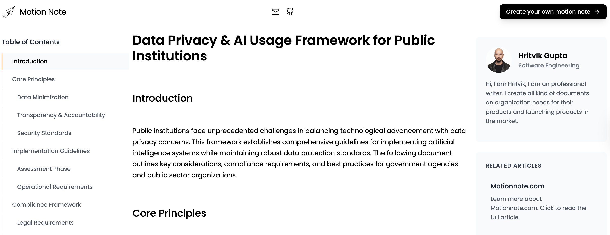
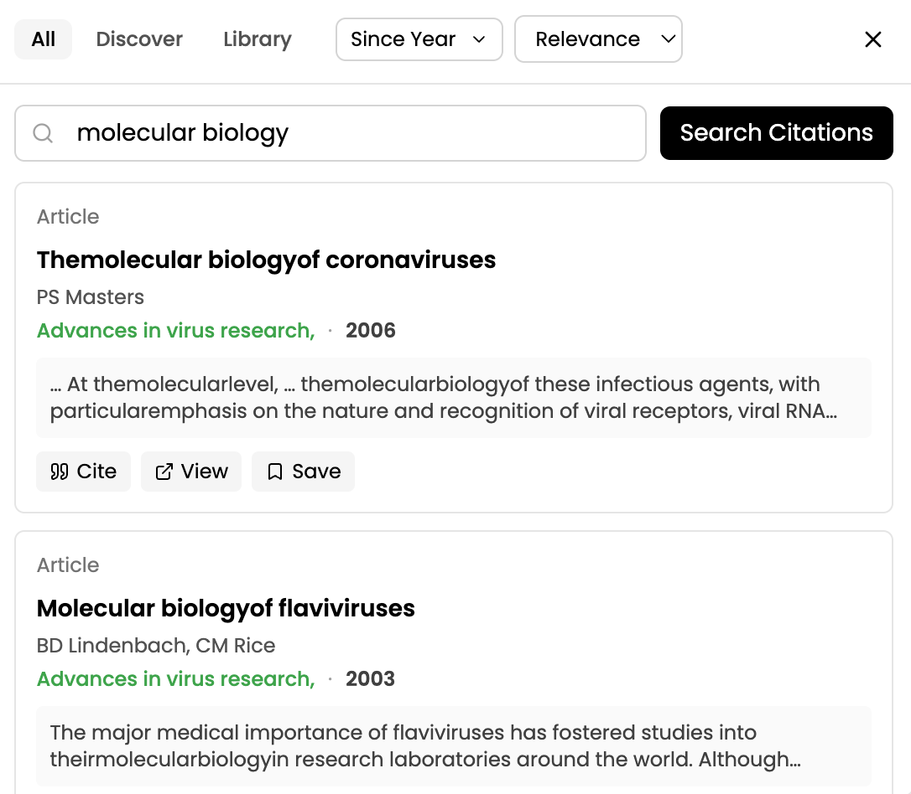
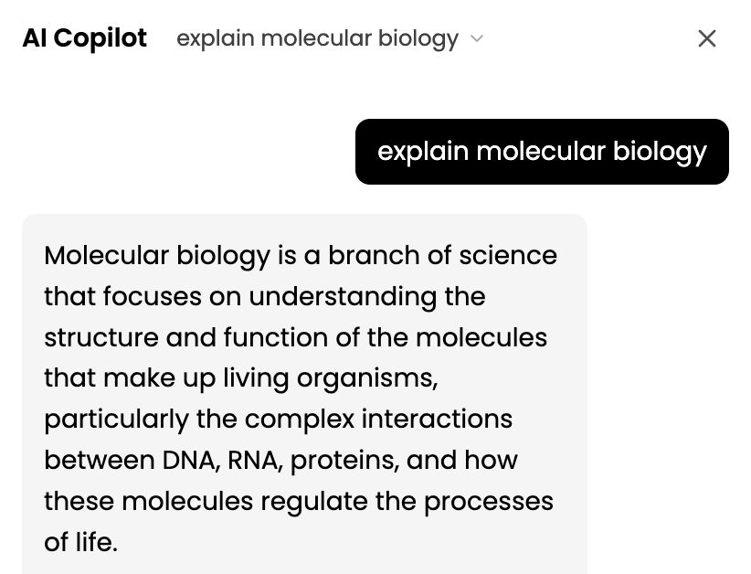
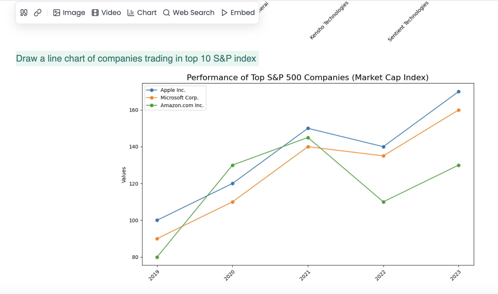
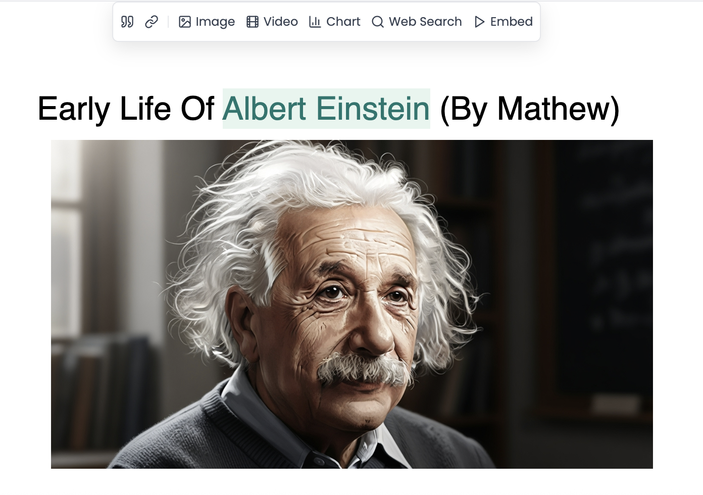
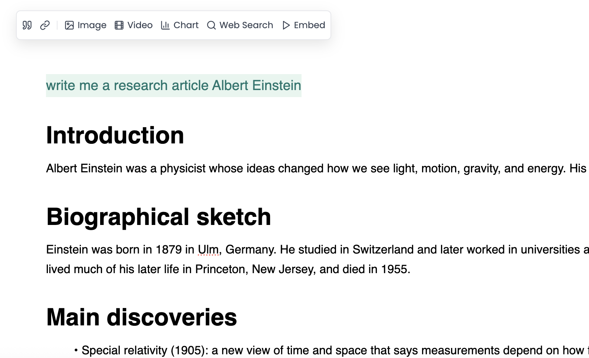

# MotionNote

**The Open Source AI-Powered Word Processor**

MotionNote is the fastest and easiest way to create, edit, and enhance documents with AI assistance.

[Website](https://motionnote.com) • [Documentation](./GETTING_STARTED.md) • [Features](./FEATURES.md) • [License](./LICENSE) • [Support](mailto:support@motionnote.com)

---

## 🚀 Quick Start

### Try MotionNote Live

Experience MotionNote right now - no sign-up required for the demo:

[**Try Live Demo →**](https://motionnote.com)

---

## 📸 Screenshots & Videos

### Product Showcase Video

See MotionNote in action - watch how AI transforms the way you work with words:

**"The First and Strongest AI Word Processor in Action"**

[▶️ Watch on YouTube](https://www.youtube.com/watch?v=hDaVSNGQgOA)

### Powerful Features

#### Share Your Story
Publish your documents to the web and share your work with the world. Create beautiful, shareable pages.

#### AI Model
Advanced AI capabilities powered by state-of-the-art models for intelligent research and writing assistance.

#### Smart Citations
Automatic citation generation with support for over 2.6k citation styles. Cite with confidence.

#### AI Copilot
Your intelligent writing companion that helps you overcome writer's block and enhance your research.

### Platform Abilities

MotionNote can handle complex tasks with ease:

#### Create Charts
Select the text you want to convert to a chart, graph, or diagram.

#### Create Images
Select the text to create an image right inside your notes.

#### Create Videos
Instantly convert your written notes into high-quality explainer videos.

#### Structured Notes → Video
Generate audio and video from your structured notes using AI.

#### Deep Web Search
Select any text to search the web and bring results back into your notes.

#### Live Transcription
Record lectures or meetings and get auto-generated transcripts directly in your notes.

*Videos demonstrating these capabilities are available in the [Platform Abilities section](https://motionnote.com) of our landing page.*

### Simplify Your Workflow

#### Generate Inline Charts and Graphs
Select any text and instantly generate contextual charts and graphs with AI.

#### Create Images from Text
Transform your selected text into stunning visuals. Simply highlight any text and watch as AI creates relevant, high-quality images.

#### Deep Research Assistant
Get instant, comprehensive research on any topic. Select text and receive detailed insights, facts, and analysis.

### AI That Writes Like a Human

Customize your AI writing assistant:

- **Select Model** - Choose from leading AI models like Claude, GPT-4, Gemini, or Qwen
- **Select Human Behaviors** - Fine-tune personality, writing style, vocabulary, tone, and other human-like behaviors
- **Choose Your Goal** - Select your role—Content Creator, Researcher, Educator, or others

*See these features in action on our [landing page](https://motionnote.com).*

### Educational Videos

MotionNote generates comprehensive educational content including:

- **Science Tutorials** - Learn complex scientific concepts with AI-generated videos
- **History Lessons** - Explore historical events through engaging video content
- **Educational Content** - Access a library of AI-generated educational videos

*Explore educational videos in the MotionNote application or visit our [landing page](https://motionnote.com).*

---

## ✨ Key Features

### 🤖 AI-Powered Features
- **AI Researcher**: Chat with your documents and get intelligent insights
- **AI Annotations**: Get AI-powered suggestions and annotations for your content
- **Knowledge Base**: Manage and reference files seamlessly
- **Human-like Writing**: AI that writes like a human, handling millions of words

### 📝 Document Editing
- **Rich Text Editing**: Full WYSIWYG editing experience
- **Markdown Support**: Write using Markdown syntax
- **Pagination Mode**: Microsoft Word-like pagination
- **Multiple Export Formats**: Export your documents in various formats
- **Print & Print Preview**: Professional printing capabilities

### 🎨 User Experience
- **Modern UI**: Clean, intuitive interface
- **Dark Mode**: Comfortable viewing in any lighting
- **Multi-language Support**: Available in multiple languages
- **Responsive Design**: Works seamlessly on all devices

### 🔒 Security & Privacy
- **Secure Authentication**: Sign in with email or Google OAuth
- **Data Privacy**: Your documents are secure and private
- **Cloud Sync**: Access your documents anywhere

---

## 🛠️ Technology Stack

MotionNote is built with modern web technologies:

- **Frontend**: Vue 3, TypeScript, Vite
- **Editor**: Tiptap (ProseMirror-based)
- **AI**: OpenAI, Perplexity, OpenRouter
- **Backend**: Node.js, Supabase
- **Styling**: Tailwind CSS

---

## 📖 Documentation

- **[Getting Started Guide](./GETTING_STARTED.md)** - Learn how to use MotionNote
- **[Features Documentation](./FEATURES.md)** - Complete feature list
- **[Links & Resources](./LINKS.md)** - All MotionNote links and resources

---

## 🚀 Getting Started

### Sign Up

1. Visit [MotionNote](https://motionnote.com)
2. Click "Get Started" or "Sign in"
3. Create your account using email/password or Google OAuth
4. Start creating your first document!

### Your First Document

1. After signing in, click "New Document"
2. Start typing or use AI features to generate content
3. Use **AI Researcher** to chat with your document
4. Use **Annotate** to get AI-powered suggestions
5. Export your document in your preferred format

---

## 📄 License

MotionNote is licensed under the MIT License. See [LICENSE](./LICENSE) file for details.

---

## 🤝 Contributing

We welcome contributions! Please see our contributing guidelines in the main repository.

---

## 📞 Contact

- **Email**: support@motionnote.com
- **Website**: [motionnote.com](https://motionnote.com)
- **Issues**: [GitHub Issues](https://github.com/your-org/motionnote/issues)

---

## 🙏 Acknowledgments

MotionNote is built on top of excellent open-source projects including:
- [Umo Editor](https://github.com/umodoc/editor) - The foundation editor
- [Tiptap](https://tiptap.dev/) - Rich text editor framework
- [Vue.js](https://vuejs.org/) - Progressive JavaScript framework

---

**Made with ❤️ by the MotionNote Team**

[⭐ Star us on GitHub](https://github.com/your-org/motionnote) • [📖 Documentation](./GETTING_STARTED.md) • [🐛 Report Bug](https://github.com/your-org/motionnote/issues)

